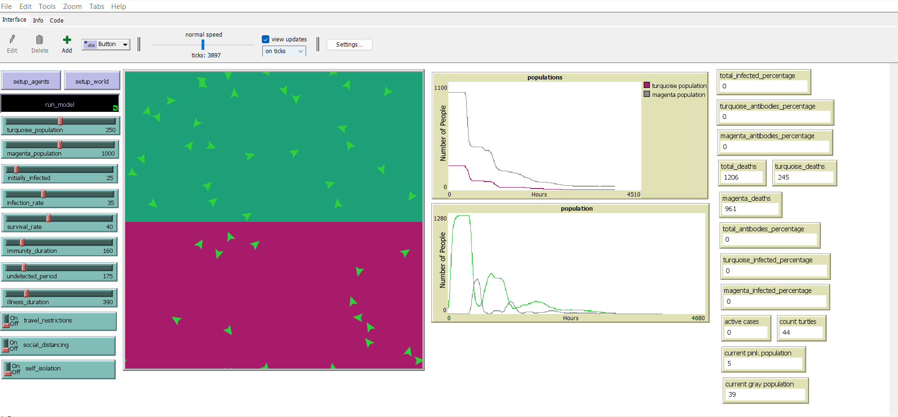

# Agent-Based Epidemic Spread Simulation

A NetLogo agent-based model simulating the spread of an infectious disease across two distinct populations. The model analyses the effectiveness of real-world public health interventions including social distancing, self-isolation, and travel restrictions on infection rates, mortality, and immunity development.



---

## Overview

This simulation models two heterogeneous populations (turquoise and magenta) living in separate regions of a shared world. A virus spreads between agents based on proximity and infection probability, and the model tracks how different intervention strategies affect the outcome over time.

The project was developed as part of the **MSc Artificial Intelligence & Robotics** programme at the **University of Hertfordshire**.

---

## Features

- **Two distinct populations** with different sizes and densities, separated into colour-coded regions
- **Realistic disease progression** — agents move through susceptible → infected → recovered/dead states
- **Antibody system** — recovered agents develop temporary immunity that fades over time
- **Three intervention strategies:**
  - **Travel Restrictions** — agents stay within their own region
  - **Social Distancing** — agents maintain minimum distance from others
  - **Self-Isolation** — infected agents stop moving once symptoms appear
- **Real-time statistics** tracking infection rates, deaths, and immunity levels per population
- **Configurable parameters** including infection rate, survival rate, immunity duration, and illness duration

---

## How It Works

Each agent (turtle) moves around the world at a fixed speed with a randomised heading. When a susceptible agent comes within range of an infected agent, there is a probability of transmission determined by the `infection_rate` variable.

Infected agents:
- Turn **orange** to indicate infection
- Have a countdown timer (`infected_time`) based on `illness_duration`
- Either die or recover based on `survival_rate`

Recovered agents:
- Turn **brown** and develop antibodies
- Antibodies fade over time (`immunity_duration`)
- Once antibodies are gone, agents become susceptible again

Self-isolating agents:
- Turn **blue** and stop moving once the undetected period has passed
- Cannot infect others while isolating

---

## Technologies Used

- [NetLogo 6.1.0+](https://ccl.northwestern.edu/netlogo/)
- Agent-based modelling
- CSV extension for data export

---

## Getting Started

### Prerequisites
- [NetLogo 6.1.0 or above](https://ccl.northwestern.edu/netlogo/download.shtml)

### Running the Simulation

1. Clone this repository:
   ```bash
   git clone https://github.com/Aro-o/Agent-Based-Epidemic-Simulation.git
   ```
2. Open NetLogo
3. Open the `.nlogo` file from this repository
4. Click **setup_world** to initialise the world
5. Click **setup_agents** to populate the agents
6. Click **run_model** (or press Go) to start the simulation

---

## Default Parameters

| Parameter | Value |
|---|---|
| Turquoise Population | 250 |
| Magenta Population | 1000 |
| Initially Infected | 25 |
| Infection Rate | 35% |
| Survival Rate | 40% |
| Immunity Duration | 160 ticks |
| Undetected Period | 175 ticks |
| Illness Duration | 390 ticks |

---

## Key Findings

The model demonstrates how different intervention strategies lead to significantly different outcomes:

- **Self-isolation** was identified as the most effective single measure — once symptomatic agents stop moving, transmission chains break significantly
- **Stay local (travel restrictions)** was found to be the least effective measure on its own, as the virus spreads rapidly within each dense region regardless
- The **magenta population** (4x larger at 1000 agents) consistently experienced higher total deaths due to density-driven transmission
- The **undetected period** (`undetected_period`) has the greatest impact on self-isolation effectiveness — the longer a disease goes undetected, the less effective isolation becomes
- With travel restrictions enabled, the virus tends to die out within each population over time as herd exposure reduces the susceptible pool
- Changing parameters mid-simulation (e.g. toggling travel restrictions or social distancing) visibly alters the infection and mortality curves in real time

---

## Author

**Aroosha Rasheed**  
MSc Artificial Intelligence & Robotics, University of Hertfordshire  
[LinkedIn](https://www.linkedin.com/in/aroosha-rasheed-a23950219) • [GitHub](https://github.com/Aro-o)
